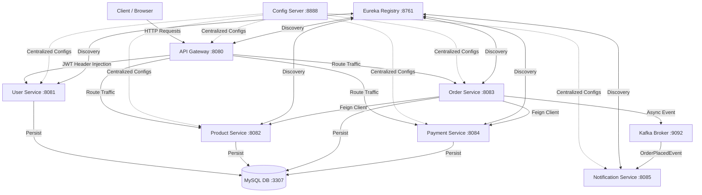

# Microservices Deployment Platform

A comprehensive microservices application built with **Java 21**, **Spring Boot 3.3.0**, **Spring Cloud 2023.0.2**, **Docker**, and **Apache Kafka**. It represents a production-grade infrastructure pattern utilizing service discovery, centralized configuration, synchronous API integration, and asynchronous event-driven architecture.

---

## Technical Architecture



---

## Tech Stack

* **Core**: Java 21, Spring Boot 3.3.0, Spring Cloud 2023.0.2 (Netflix Eureka, Config Server, Gateway, OpenFeign)
* **Security**: JSON Web Token (JWT) stateless auth filter
* **Database**: MySQL 8.0 (persisted volumes, dynamic init scripts)
* **Messaging**: Apache Kafka (Zookeeper-based broker orchestration)
* **Containerization**: Docker, Docker Compose (multi-stage optimized Alpine JRE images)

---

## Repository Structure

```text
├── docker/
│   ├── docker-compose.yml       # Orchestrates all infrastructure & service containers
│   └── init.sql                 # Automatically creates databases (user_db, product_db, etc.)
├── microservices/
│   ├── pom.xml                  # Parent Reactor POM (Lombok, Boot versioning)
│   ├── eureka-server/           # Service discovery registry
│   ├── config-server/           # Centralized configuration server (Native configuration repository)
│   ├── config-repo/             # Folder containing YAML configuration files for services
│   ├── api-gateway/             # Gateway router with custom JWT authorization filter
│   ├── user-service/            # Authentication endpoint, user CRUD & JWT signing
│   ├── product-service/         # Product catalog and stock manager
│   ├── order-service/           # Order placement workflow orchestrator (Feign client + Kafka)
│   ├── payment-service/         # Mock payment handler
│   └── notification-service/    # Asynchronous Kafka message consumer
└── web-ui/                      # Single-page Dark-mode Web UI dashboard interface for visual E2E testing
```

---

## Getting Started

### 1. Build Executable JARs
Navigate to the `microservices` directory and run the Maven packaging goal:
```bash
cd microservices
mvn clean package -DskipTests
```

### 2. Deploy Container Stack
Launch the environment in detached mode:
```bash
cd ../docker
docker compose up -d
```
*Note: MySQL is exposed on host port `3307` to avoid conflicts with any local MySQL server running on `3306`.*

### 3. Check Registrations
Access the Eureka Discovery Console to check if all services are fully registered:
* **Eureka Console**: [http://localhost:8761](http://localhost:8761)

### 4. Access the Web UI Control Panel
The platform includes an interactive, dark-mode Single-Page Application (SPA) dashboard for executing user flows:
* Start a local web server inside the `web-ui` directory:
  ```bash
  cd web-ui
  python -m http.server 8000
  ```
* Navigate to **[http://localhost:8000](http://localhost:8000)** in your browser.
* Register or log in to generate a JWT token, browse products, publish new items (requires ADMIN role), and perform real-time transactions.

---

## End-to-End Test Suite

### Option A: PowerShell Test Client
Open PowerShell and run the following script to execute the complete checkout flow (Registers user -> Logins/Fetches JWT -> Creates Product -> Places Order via Gateway):

```powershell
# 1. Acquire JWT Token (Login if exists, Register otherwise)
$credentials = @{
    username = "admin"
    password = "password123"
    email = "admin@example.com"
    role = "ADMIN"
}

try {
    Write-Host "Attempting login..."
    $loginBody = @{ username = $credentials.username; password = $credentials.password } | ConvertTo-Json
    $auth = Invoke-RestMethod -Uri "http://localhost:8080/api/users/login" -Method Post -Body $loginBody -ContentType "application/json" -TimeoutSec 10
    $token = $auth.token
    Write-Host "Logged in successfully! Token acquired."
} catch {
    Write-Host "Login failed (user might not exist yet). Registering user..."
    try {
        $registerBody = $credentials | ConvertTo-Json
        $auth = Invoke-RestMethod -Uri "http://localhost:8080/api/users/register" -Method Post -Body $registerBody -ContentType "application/json" -TimeoutSec 10
        $token = $auth.token
        Write-Host "Registered successfully! Token acquired."
    } catch {
        Write-Host "Error acquiring token: $($_.Exception.Message)"
        exit
    }
}

# 2. Create a Product (ADMIN permission required)
$headers = @{ Authorization = "Bearer $token" }
$productBody = @{
    name = "Developer Workstation"
    description = "High-end laptop"
    price = 1500.00
    stock = 25
} | ConvertTo-Json
$product = Invoke-RestMethod -Uri "http://localhost:8080/api/products" -Method Post -Body $productBody -ContentType "application/json" -Headers $headers
Write-Host "Product ID: $($product.id) | Stock: $($product.stock)"

# 3. Place an Order (Deducts stock & processes payment)
$orderBody = @{
    productId = $product.id
    quantity = 3
} | ConvertTo-Json
$order = Invoke-RestMethod -Uri "http://localhost:8080/api/orders" -Method Post -Body $orderBody -ContentType "application/json" -Headers $headers
Write-Host "Order Status: $($order.orderStatus) | Total Price: $($order.totalPrice)"
```

### Option B: curl Commands

#### 1. Register
```bash
curl -X POST http://localhost:8080/api/users/register \
  -H "Content-Type: application/json" \
  -d '{"username":"admin","password":"password123","email":"admin@example.com","role":"ADMIN"}'
```

#### 2. Create Product
```bash
curl -X POST http://localhost:8080/api/products \
  -H "Authorization: Bearer <TOKEN>" \
  -H "Content-Type: application/json" \
  -d '{"name":"Mouse","description":"Wireless Mouse","price":50.00,"stock":100}'
```

#### 3. Create Order
```bash
curl -X POST http://localhost:8080/api/orders \
  -H "Authorization: Bearer <TOKEN>" \
  -H "Content-Type: application/json" \
  -d '{"productId":1,"quantity":2}'
```

---

## Kubernetes Orchestration

The platform is configured with production-grade Kubernetes manifest files located in the [k8s/](file:///c:/Users/prana/PG/Projects/Microservices%20Deployment%20Platform/k8s/) directory.

### Deploying to local Kubernetes
Ensure you have a running cluster (e.g. Minikube, Kind, or Docker Desktop K8s) and run:
```bash
# Apply MySQL & Infrastructure Configs
kubectl apply -f k8s/mysql-init-configmap.yaml
kubectl apply -f k8s/mysql-pv-pvc.yaml
kubectl apply -f k8s/mysql-deployment.yaml
kubectl apply -f k8s/mysql-service.yaml

# Apply Kafka Event Broker
kubectl apply -f k8s/zookeeper.yaml
kubectl apply -f k8s/kafka.yaml

# Apply Registry & Configuration Servers
kubectl apply -f k8s/config-repo-configmap.yaml
kubectl apply -f k8s/eureka-server.yaml
kubectl apply -f k8s/config-server.yaml

# Apply Microservices, Gateway and Ingress Controller Routers
kubectl apply -f k8s/microservices-deployments.yaml
kubectl apply -f k8s/api-gateway.yaml
kubectl apply -f k8s/ingress.yaml
```

---

## CI/CD Pipeline

The project includes an automated GitHub Actions workflow configured in [.github/workflows/ci-cd.yml](file:///c:/Users/prana/PG/Projects/Microservices%20Deployment%20Platform/.github/workflows/ci-cd.yml).

On every `push` and `pull_request` to the `main` or `master` branches, the pipeline will:
1. Check out the codebase.
2. Set up JDK 21 environment using **Eclipse Temurin** distribution with caching enabled.
3. Build the Maven modules and run unit tests (`mvn clean package`).
4. Build local Docker images for all 8 microservices modules to ensure compilation and packaging integrity.

---

## Observability & Metrics

Prometheus and Grafana configurations are provisioned inside the [observability/](file:///c:/Users/prana/PG/Projects/Microservices%20Deployment%20Platform/observability/) directory. All microservices automatically export standard Micrometer JVM metrics on `/actuator/prometheus`.

### Deploying the Observability Stack:
```bash
# Deploy Prometheus Scraper and Grafana Console
kubectl apply -f observability/prometheus-k8s.yaml
kubectl apply -f observability/grafana-k8s.yaml
```

### Accessing the Grafana Console:
1. Port-forward the Grafana dashboard locally:
   ```bash
   kubectl port-forward svc/grafana 3000:3000
   ```
2. Navigate to [http://localhost:3000](http://localhost:3000) (Default login: `admin` / `admin`).
3. The Prometheus datasource (`http://prometheus:9090`) is **pre-provisioned** and ready to query.

